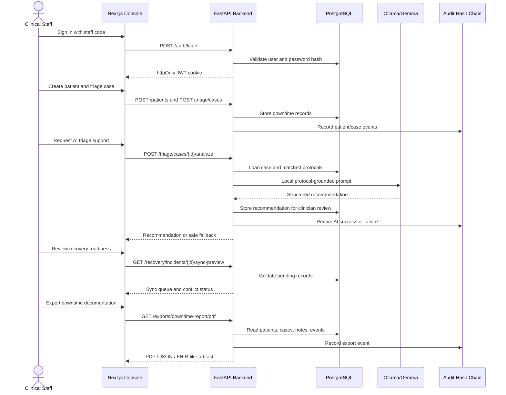
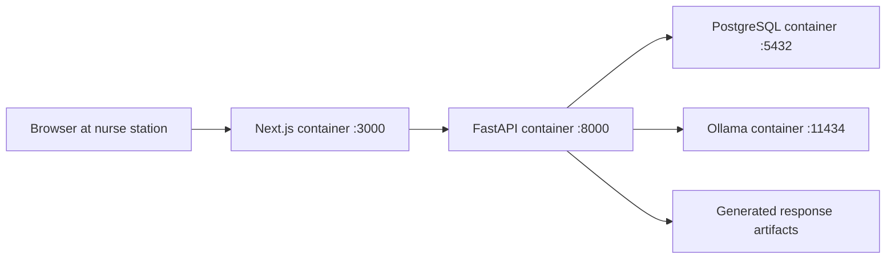

# BlackoutCare System Design

This document gives judges a fast technical map of how BlackoutCare works during a hospital downtime event.

## High-Level Architecture

```mermaid
flowchart TB
  subgraph Users["Hospital Downtime Team"]
    Clinician["Doctor / Nurse"]
    Coordinator["Coordinator / Admin"]
  end

  subgraph Web["Next.js Frontend"]
    Login["Login + Session Check"]
    Dashboard["Command Dashboard"]
    Triage["Triage Workspace"]
    Safety["Safety Board"]
    Operations["Operations Cockpit"]
    Recovery["Recovery Sync Center"]
    Staff["Staff Admin"]
  end

  subgraph API["FastAPI Backend"]
    Auth["Auth Router"]
    PatientAPI["Patient Router"]
    TriageAPI["Triage Router"]
    ProtocolAPI["Protocol Router"]
    AIRouter["AI Router"]
    OpsAPI["Operations Router"]
    RecoveryAPI["Recovery Router"]
    ExportAPI["Export Router"]
    EventAPI["Audit Event Router"]
  end

  subgraph Services["Backend Services"]
    TriageService["Triage Service"]
    AIService["Protocol-Grounded AI Service"]
    RecoveryService["Recovery Validation Service"]
    ExportService["Report + Bundle Service"]
    AuditService["Tamper-Evident Event Hashing"]
  end

  subgraph Data["Local Downtime Data Plane"]
    DB[("PostgreSQL")]
    Ollama["Ollama Gemma Model"]
    Artifacts["PDF, JSON, FHIR-like Exports"]
  end

  Clinician --> Login
  Coordinator --> Login
  Login --> Dashboard
  Dashboard --> Triage
  Dashboard --> Safety
  Dashboard --> Operations
  Dashboard --> Recovery
  Dashboard --> Staff

  Web -->|JWT cookie| API
  Auth --> DB
  PatientAPI --> DB
  TriageAPI --> TriageService
  ProtocolAPI --> DB
  AIRouter --> AIService
  OpsAPI --> DB
  RecoveryAPI --> RecoveryService
  ExportAPI --> ExportService
  EventAPI --> DB

  TriageService --> DB
  TriageService --> AuditService
  AIService --> ProtocolAPI
  AIService --> Ollama
  AIService --> DB
  AIService --> AuditService
  RecoveryService --> DB
  RecoveryService --> AuditService
  ExportService --> DB
  ExportService --> Artifacts
  ExportService --> AuditService
  AuditService --> DB
```

## Critical Design Choices

- Local-first operation: the application, database, and AI model can run on local hospital infrastructure through Docker Compose.
- Protected clinical workflows: dashboard routes call `/auth/me`; backend routes enforce JWT authentication and role-aware access where needed.
- Protocol-grounded AI: triage analysis includes local protocol matches so recommendations are tied to downtime policy context.
- Safe AI degradation: if Ollama is unavailable or returns invalid output, the backend returns fallback guidance instead of breaking the workflow.
- Auditability: important actions write audit events with previous/current hashes to help detect tampering.
- Recovery readiness: records carry sync status and can be exported as downtime reports or FHIR-like recovery bundles.

## Main Runtime Sequence

## Deployment View

Docker Compose exposes local host ports `3000`, `8000`, `5433`, and `11434` for the demo environment.
